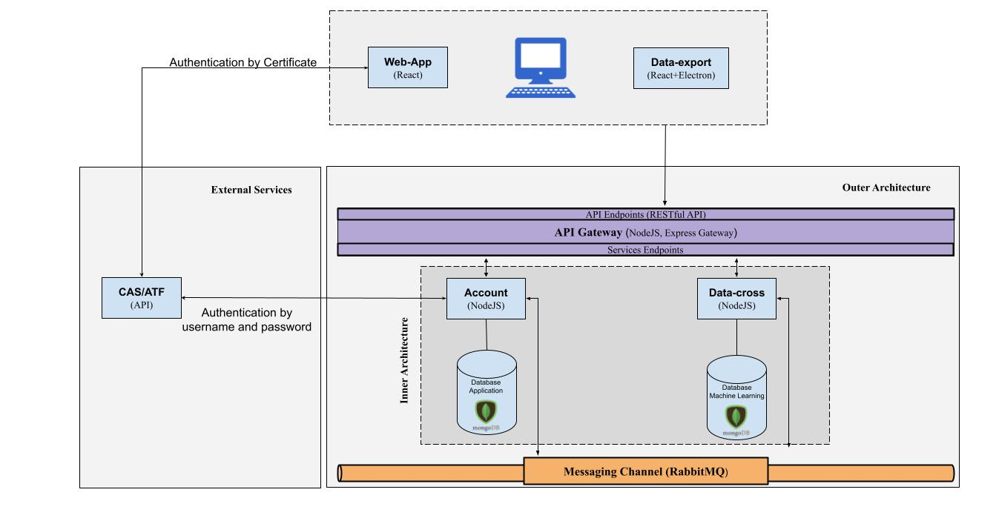

# Welcome !!

  
    

  Organization for the development of projects carried out in partnership between NUTES/UEPB and Sefaz/PB

  

<ul>
  <li><a href="https://docs.google.com/document/d/1RI5e3zcStsiaZsjJy64ht-fzMomoV5NnqKUipxxPy7c">01 - Documento de Visão</li>  
  <li><a href="https://docs.google.com/document/d/1s8bpVrLdCBKIW5S_Irn-aWW4a2K5NWJUEkdy9Dy0zaE">02 - Documento de Controle de Acesso</li>  
  <li><a href="https://docs.google.com/document/d/1gFcPG1-RwVap_Jl3-FddYv3XowTqrCy8ObMhf_K1r3E">03 - Documento de Requisitos</li>  
  <li><a href="https://docs.google.com/document/d/1POmoQt9b6AeXGWgPjeSpYfr7f0pSqG6FNvlOdgBqmKk">04 - Documento de Arquitetura</li>    
  <li><a href="https://docs.google.com/document/d/19y6_DB1n6zrTx2goTLTR1XDXklhpJ0Xpfk9-oZtxhbM">05 - Documento de Implantação</li>    
  <li><a href="https://docs.google.com/document/d/1Iw2hxFewVYYyKB_gycbxgCktC4qAmq1AyhQD8EVZC9Q">06 - Manual do Usuário</li>    
</ul>

 Partnership: <a href="http://nutes.uepb.edu.br/">NUTES-UEPB</a> | <a href="https://www.sefaz.pb.gov.br/">SEFAZ-PB</a>

